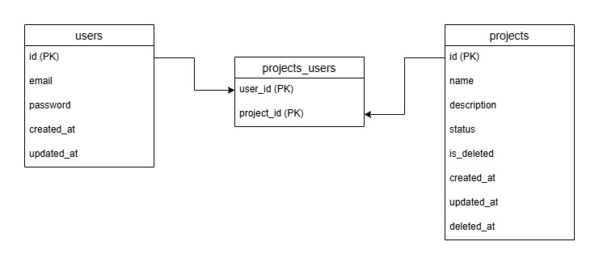

# Cartera de Proyectos

## Descripción

Cartera de Proyectos es una aplicación web diseñada para gestionar proyectos. Incluye un backend desarrollado en Python con Flask, una base de datos SQL para el almacenamiento de datos, y un frontend construido con React, TypeScript y Vite. La aplicación permite a los usuarios crear, editar estado y eliminar proyectos. Cuenta con un login simple para simular la autenticación de usuario y la obtención de sus proyectos.

## Características principales

- **Gestión de proyectos:** Crear, editar estado y eliminar proyectos.
- **Autenticación:** Sistema básico de usuarios para simular la autenticación.

## Tecnologías utilizadas

- **Frontend:** React, TypeScript, Vite.
- **Backend:** Python, Flask, SQLAlchemy.
- **Base de datos:** PostgreSQL con uso de scripts de inicialización.
- **Infraestructura:** Docker.

## Requisitos previos para desplegar

- Docker instalado.

## Configuración inicial

1. Clona este repositorio:
   ```bash
   git clone https://github.com/Patricia97M/cartera-proyectos.git
   ```
2. Navega al directorio del proyecto:
   ```bash
   cd cartera-proyectos
   ```

## Despliegue con Docker

1. Construye y levanta los contenedores:

   windows:

   ```bash
   docker-compose up --build
   ```

   linux:

   ```bash
   sudo docker-compose up --build
   ```

2. Accede a la aplicación:
   - **Frontend:** `http://localhost:3000`
   - **Backend:** `http://localhost:4000`

## Datos de prueba

Utiliza las siguientes credenciales para iniciar sesión y probar la aplicación:

- **Usuario 1:**
  - Correo: `user_1@test.com`
  - Contraseña: `1234`
- **Usuario 2:**
  - Correo: `user_2@test.com`
  - Contraseña: `5678`

## Documentación de las rutas

### Backend

#### **Autenticación**

- **POST /login**
  - **Descripción:** Inicia sesión con un usuario existente.
  - **Cuerpo de la solicitud:**
    ```json
    {
      "email": "user_1@test.com",
      "password": "1234"
    }
    ```
  - **Respuesta exitosa:**
    ```json
    {
      "message": "Login successful",
      "status": "SUCCESS",
      "user": {
        "id": 1,
        "email": "user_1@test.com"
      }
    }
    ```

#### **Proyectos**

- **GET /proyectos?email={email}**

  - **Descripción:** Obtiene los proyectos asociados a un usuario.
  - **Parámetros de consulta:**
    - `email` (obligatorio): Correo del usuario.
  - **Respuesta exitosa:**
    ```json
    [
      {
        "id": 1,
        "name": "Project 1",
        "description": "Description for project 1",
        "status": "enabled",
        "createdAt": "2025-12-16T00:00:00Z",
        "updatedAt": "2025-12-16T00:00:00Z"
      }
    ]
    ```

- **POST /proyectos**

  - **Descripción:** Crea un nuevo proyecto para un usuario.
  - **Cuerpo de la solicitud:**
    ```json
    {
      "email": "user_1@test.com",
      "name": "Nuevo Proyecto",
      "description": "Descripción del proyecto",
      "status": "enabled"
    }
    ```
  - **Respuesta exitosa:**
    ```json
    {
      "message": "Project created successfully",
      "status": "SUCCESS",
      "project": {
        "id": 4,
        "name": "Nuevo Proyecto",
        "description": "Descripción del proyecto",
        "status": "enabled"
      }
    }
    ```

- **PATCH /proyectos/{id}**

  - **Descripción:** Actualiza el estado de un proyecto.
  - **Cuerpo de la solicitud:**
    ```json
    {
      "status": "disabled"
    }
    ```
  - **Respuesta exitosa:**
    ```json
    {
      "message": "Project status updated successfully",
      "status": "SUCCESS",
      "project": {
        "id": 1,
        "name": "Project 1",
        "description": "Description for project 1",
        "status": "disabled"
      }
    }
    ```

- **DELETE /proyectos/{id}**
  - **Descripción:** Elimina un proyecto de forma lógica.
  - **Respuesta exitosa:**
    ```json
    {
      "message": "Project deleted successfully",
      "status": "SUCCESS"
    }
    ```

## Modelo de datos


